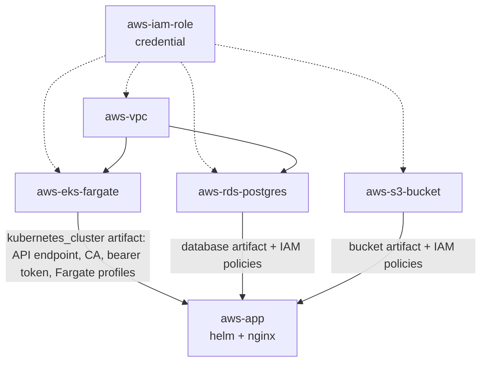

# AWS Application Stack — Catalog Setup Guide

A Massdriver catalog of AWS-prefixed bundles that compose into a working application stack: VPC → EKS Fargate → RDS Postgres + S3 → Helm-deployed app. Bring your AWS account, an IAM role for Massdriver to assume, and follow this guide end to end.

## What's in this catalog

### Resource types

| Resource type | Shape | Used by |
| --- | --- | --- |
| `aws-iam-role` | Cross-account IAM role + external_id | All AWS bundles (auth) |
| `aws-vpc` | VPC ID, CIDR, region, subnets, account_id | EKS, RDS |
| `aws-eks-cluster` | Cluster ARN, endpoint, CA, region, Fargate profile inventory, and a long-lived bearer token | App (helm step) |
| `aws-rds-postgres` | Writer/reader endpoints, IAM-bindable policies, Secrets Manager ARN | App |
| `aws-s3-bucket` | Bucket ARN/name/region, KMS ARN, IAM-bindable policies | App |
| `aws-application` | Workload identifier, IAM role, namespace, service URL | (output of app) |

### Bundles

| Bundle | What it provisions |
| --- | --- |
| `aws-vpc` | VPC, public + private subnets across 2–3 AZs, optional NAT Gateway, locked-down default SG/NACL, optional VPC Flow Logs |
| `aws-eks-fargate` | EKS control plane, configurable Fargate profiles, an in-cluster `massdriver` ServiceAccount with a long-lived bearer token used by the Massdriver helm provisioner |
| `aws-rds-postgres` | RDS Postgres instance + 0–5 read replicas, parameter group with `rds.force_ssl=1` and pg_stat_statements, Multi-AZ optional, Secrets Manager-backed credentials, IAM database auth, enhanced monitoring |
| `aws-s3-bucket` | S3 bucket tuned for user-uploaded content (CORS, presign-friendly, KMS, lifecycle archive/expire), optional event notifications via SNS, optional cross-region replication |
| `aws-app` | A Helm chart shipped inside the bundle that deploys nginx (`public.ecr.aws/nginx/nginx:1.27`) on EKS Fargate, with connection metadata from the connected RDS and S3 wired into the pod as env vars. Use it as a reference for the wiring pattern; fork the chart for real workloads. |

### Helm chart template

`templates/aws-helm-chart/` is a Massdriver bundle template that scaffolds new helm-deployed app bundles wired to `aws-eks-cluster` (and optionally `aws-rds-postgres` and `aws-s3-bucket`). App teams scaffold their own bundle with `mass bundle new` and add the params their app needs.

## How the bundles compose



Solid arrows are required wires. Dashed arrows show that the IAM role flows in as an environment-default connection rather than a per-component link.

## Prerequisites

- A Massdriver organization with **admin rights to publish resource types**. Resource types are organization-wide; bundle publishing alone is not sufficient. If your service account can publish bundles but `mass resource-type publish` returns `You do not have permission to publish a resource type`, ask an org admin to either elevate your service account's role or run the resource-type publish step on your behalf.
- An AWS account where you can create an IAM role with `AdministratorAccess` (or a tighter equivalent — the role needs to provision VPCs, IAM resources, KMS keys, EKS, RDS, and S3).
- Per-region VPC quota of at least one free slot (default is 5 per region). Pick a region with capacity. The `aws-vpc` bundle's `region` enum supports the standard 10 AWS regions.
- `mass` CLI v2.x and `kubectl`, `aws`, `helm`, `psql` if you plan to run the operator runbooks.

## Setup

### 1. Clone and configure

```bash
git clone git@github.com:YOUR_ORG/massdriver-catalog.git
cd massdriver-catalog

mass config init
# fill in organization_id and a Service Account API key
```

`mass config init` writes `$HOME/.config/massdriver/config.yaml`. Or set `MASSDRIVER_ORGANIZATION_ID` and `MASSDRIVER_API_KEY` environment variables.

### 2. Configure your AWS credential

Create the IAM role Massdriver will assume. The trust policy and CloudFormation one-click templates live at `platforms/aws/instructions/`. Once the role exists, import it into Massdriver:

```bash
mass resource-type publish platforms/aws/massdriver.yaml

# Then in the Massdriver UI: Settings → Credentials → AWS IAM Role,
# paste the role ARN and external ID.
```

### 3. Publish resource types

These are organization-wide and require admin rights:

```bash
for rt in aws-application aws-eks-cluster aws-rds-postgres aws-s3-bucket aws-vpc; do
  mass resource-type publish resource-types/$rt/massdriver.yaml
done
```

### 4. Publish bundles

```bash
make publish-bundles
```

That target creates the OCI repo for each bundle (idempotent) and publishes a stable release. For iterating, use `mass bundle publish --bundle-directory bundles/<name> --development`, which produces a `0.0.0-dev.<timestamp>` release that instances on the development release channel auto-pick up.

### 5. Build a project canvas

```bash
PROJECT=mystack

mass project create $PROJECT --name "My App Stack"

mass component add $PROJECT aws-vpc          --id vpc      --name "VPC"
mass component add $PROJECT aws-eks-fargate  --id cluster  --name "EKS Cluster"
mass component add $PROJECT aws-rds-postgres --id db       --name "PostgreSQL"
mass component add $PROJECT aws-s3-bucket    --id uploads  --name "User Uploads"
mass component add $PROJECT aws-app          --id app      --name "Application"

mass component link $PROJECT-vpc.vpc                    $PROJECT-cluster.vpc
mass component link $PROJECT-vpc.vpc                    $PROJECT-db.vpc
mass component link $PROJECT-cluster.kubernetes_cluster $PROJECT-app.eks
mass component link $PROJECT-db.database                $PROJECT-app.database
mass component link $PROJECT-uploads.bucket             $PROJECT-app.bucket
```

### 6. Create an environment and attach the AWS credential

```bash
mass environment create $PROJECT-test --project $PROJECT
mass environment default $PROJECT-test aws-iam-role <iam-role-resource-id>
```

The IAM role flows into every AWS bundle in this environment as the `aws_authentication` connection — no per-component link required.

### 7. Pin instances to the development release channel (optional, recommended during a POC)

```bash
for c in vpc cluster db uploads app; do
  mass instance version $PROJECT-test-$c@latest --release-channel development
done
```

Now every `mass bundle publish --development` against a bundle auto-redeploys the corresponding instance.

### 8. Configure and deploy

Each instance accepts a JSON / YAML / TOML params file. Examples:

```bash
# VPC
cat > /tmp/vpc.json <<'EOF'
{
  "region": "us-west-1",
  "cidr": "10.0.0.0/16",
  "availability_zone_count": 2,
  "nat_gateway_mode": "single",
  "enable_flow_logs": true,
  "enable_dns_hostnames": true
}
EOF
mass instance deploy $PROJECT-test-vpc --params=/tmp/vpc.json -m "initial"

# EKS Fargate (after VPC artifact appears)
cat > /tmp/cluster.json <<'EOF'
{
  "cluster_name": "mystack",
  "kubernetes_version": "1.30",
  "fargate_namespaces": ["default", "kube-system", "app"]
}
EOF
mass instance deploy $PROJECT-test-cluster --params=/tmp/cluster.json -m "initial"

# RDS
cat > /tmp/db.json <<'EOF'
{
  "database_name": "appdb",
  "username": "appadmin",
  "engine_version": "16",
  "instance_class": "db.t4g.medium",
  "allocated_storage_gb": 20,
  "max_allocated_storage_gb": 100,
  "multi_az": false,
  "read_replica_count": 0,
  "backup_retention_days": 7,
  "deletion_protection": false,
  "iam_database_auth": true
}
EOF
mass instance deploy $PROJECT-test-db --params=/tmp/db.json -m "initial"

# S3
cat > /tmp/s3.json <<'EOF'
{
  "bucket_name_prefix": "mystack-uploads",
  "cors_origins": ["http://localhost:3000"],
  "max_upload_size_mb": 100,
  "versioning": "enabled",
  "encryption": "sse-kms",
  "block_public_access": true,
  "object_ownership": "bucket-owner-enforced"
}
EOF
mass instance deploy $PROJECT-test-uploads --params=/tmp/s3.json -m "initial"

# App
cat > /tmp/app.json <<'EOF'
{
  "namespace": "app",
  "replicas": 1
}
EOF
mass instance deploy $PROJECT-test-app --params=/tmp/app.json -m "initial"
```

### 9. Verify the chain

Once the app is up, exec into the nginx pod and confirm the connection metadata flowed in as env vars:

```bash
aws eks update-kubeconfig --region us-west-1 --name mystack
POD=$(kubectl get pod -n app -l app.kubernetes.io/instance=app -o jsonpath='{.items[0].metadata.name}')
kubectl exec -n app "$POD" -- env | grep -E '^(DB|S3|EKS)_'
```

You should see `DB_HOST`, `S3_BUCKET`, `EKS_CLUSTER_NAME`, etc., populated from the connected RDS, S3, and EKS bundles. Passwords and tokens are not in env vars — `DB_SECRET_ARN` points at Secrets Manager. The `aws-app` bundle is a wiring demo; it does not bind IAM policies to the pod. When you fork it for a real workload, use an IRSA role bound to one of the connected bundle's `policies` to grant runtime access.

## Compliance posture

Each bundle ships a Checkov gate as part of its provisioner step config:

```yaml
config:
  checkov:
    halt_on_failure: '.params.md_metadata.default_tags["md-target"] | test("^(prod|prd|production)$")'
```

Findings always surface in the deploy log. They **block** deployment when the environment slug matches `prod`, `prd`, or `production`. Lower environments deploy through with warnings. Adjust the regex in each bundle's `massdriver.yaml` if your environment naming differs.

The skip lists in `bundles/*/src/.checkov.yml` cover only:

- **False positives** — Checkov can't trace cross-module references (flow log → VPC, NAT EIP → NAT GW, ingress to a 443-only egress rule rendered through a plan).
- **Project-policy decisions** — this catalog does not provision customer-managed KMS keys (cost, key-rotation surface), so checks that mandate CMKs are skipped with that reason.

Configurable controls (Multi-AZ, deletion protection, EKS public-endpoint, S3 cross-region replication, etc.) are **not** skipped. They fire on lower envs as a reminder; production presets set them so the prod gate passes.

## Iterating during a POC

Development releases are timestamped pre-releases that don't bump the bundle's official version. Workflow:

```bash
# 1. Edit bundles/<name>/src/*.tf or chart/
# 2. Publish a development release
mass bundle publish --bundle-directory bundles/<name> --development

# 3. Instances on release-channel=development auto-deploy.
#    Or trigger explicitly:
mass instance deploy $PROJECT-test-<component> -m "what changed"
```

Bundles auto-redeploy in instance-name order. To watch: `mass deployment list $PROJECT-test-<component>` and `mass deployment logs <id>`.

When the bundle is stable, bump `version:` in `bundles/<name>/massdriver.yaml`, run `mass bundle publish` (no `--development`), and switch instances back to `--release-channel stable`.

## Troubleshooting

Per-bundle runbooks live in `bundles/<name>/operator.md`. They use mustache templating against the live instance's params, connections, and artifacts, so the commands they show are pre-filled with the cluster name, VPC ID, bucket name, and so on. View them through the Massdriver UI for the rendered version.

## Known limitations

- The Massdriver helm provisioner expects a v1-shaped authentication block at `.kubernetes_cluster.data.authentication.cluster.server` / `.data.authentication.user.token`. The `aws-eks-cluster` artifact in this catalog is flat (no `data` wrapper); the `aws-app` bundle's helm step shapes the v1 contract inline with a jq expression. Other helm bundles consuming `aws-eks-cluster` need the same shaping.
- The helm provisioner authenticates with a static bearer token. The `aws-eks-fargate` bundle creates an in-cluster `massdriver` ServiceAccount with a `kubernetes.io/service-account-token` Secret so the provisioner has something stable to authenticate with — short-lived `aws eks get-token` tokens (~15 min) don't fit the provisioner's contract.
- IRSA is not provisioned by this catalog. The EKS bundle does not create an `aws_iam_openid_connect_provider`. If a workload needs IRSA, fetch the cluster's OIDC issuer URL with `aws eks describe-cluster` and create the provider out-of-band.
- VPC quota is per-region (default 5). Bumping it via AWS Service Quotas is required if your sandbox account is at the limit.
